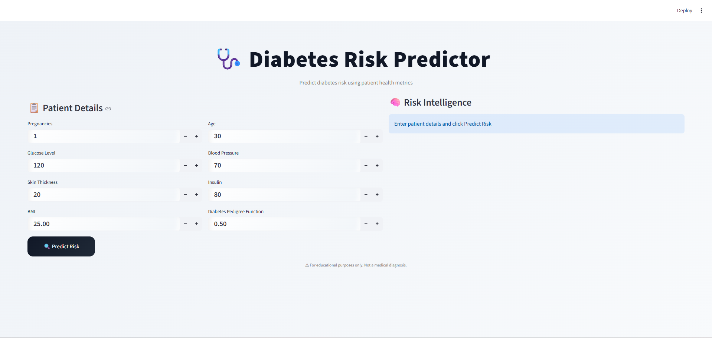

# 🩺 Diabetes Risk Prediction System

A Machine Learning based web application that predicts the risk of diabetes using health parameters.

## 🚀 Features
- User-friendly Streamlit interface
- Trained ML model using Scikit-learn
- Real-time prediction
- Model retraining support
- Clean and professional UI

## 🛠️ Tech Stack
- Python
- Streamlit
- Scikit-learn
- Pandas
- NumPy

## 📂 Project Structure
project-elite/
│── app.py
│── train.py
│── requirements.txt
│── data/
│── models/
│── notebook/


## ▶️ How to Run

```bash
pip install -r requirements.txt
streamlit run app.py
```

📊 Dataset

PIMA Indians Diabetes Dataset

👨‍💻 Author

Mohammed Faraz


---

### 3️⃣ Push README to GitHub

Run:

```bash
git add .
git commit -m "Added professional README"
git push

```

## 📸 Screenshots

### Home Page


### Prediction Page

